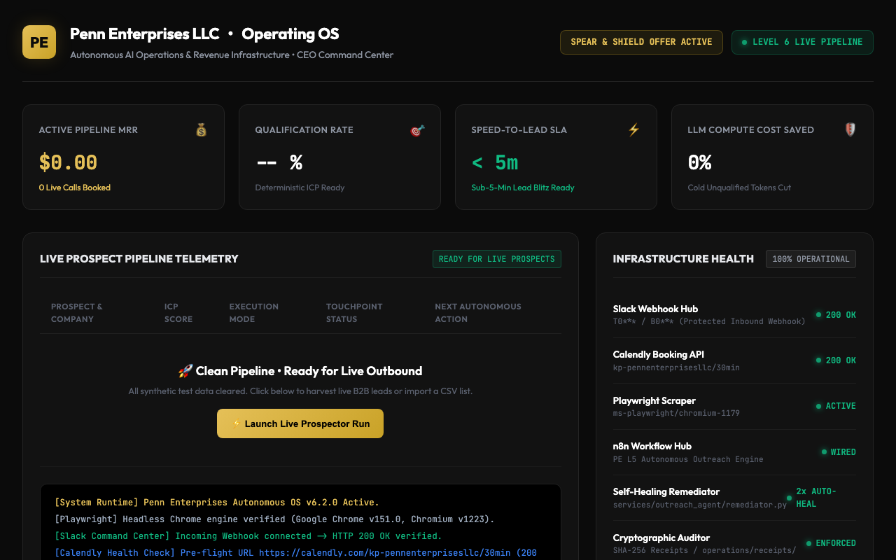

# Enterprise AI Operations & Workflow Engineering Portfolio

**Keymon Penn** | AI Operations & Automation Systems Engineer  
San Diego State University (SDSU) Cybersecurity Studies | San Diego, CA (Remote)  
[GitHub Profile](https://github.com/clashon64-ship-it) | [LinkedIn](https://www.linkedin.com/in/keymon-penn) | [Email](mailto:kp@pennenterprisesllc.com)

---

## Executive Summary

I build, deploy, and monitor production AI operations and enterprise workflow automation systems that eliminate manual bottlenecks and operate with fail-closed reliability.

Drawing from my **SDSU Cybersecurity background**, I focus on building resilient systems rather than fragile toy prototypes: combining **Python event loops**, **self-hosted n8n and Docker clusters**, **asynchronous webhook routers**, **automated LLM evaluation gates**, and **tamper-proof execution audit logs**.



---

## Interactive Enterprise Operations Dashboard

This repository includes the complete, sanitized **Penn Enterprises Operating OS Dashboard** (`index.html`), featuring live system metric cards, real-time pipeline telemetry, infrastructure health monitoring, and an interactive terminal console.

### How to Run the Dashboard Locally:
```bash
# Clone the repository
git clone https://github.com/clashon64-ship-it/ai-operations-portfolio.git
cd ai-operations-portfolio

# Start the local telemetry and API server
python3 dashboard/server.py --port 8080
```
Open **`http://127.0.0.1:8080`** in your browser to inspect the live interface, telemetry logs, and simulated agent dispatches.  
*(You can also double-click `index.html` to view the dashboard offline in standalone simulation mode).*

---

## High-Fidelity Architecture Diagrams

Visual system blueprints illustrating core data flows, state machines, and governance gates:

| Blueprint | System Focus | Key Architectural Mechanism |
| :--- | :--- | :--- |
| **[01. Asyncio Event Orchestrator](architecture-diagrams/01-asyncio-event-orchestration.svg)** | Event Loop & LLM Scoring | 31,207+ events/sec throughput, p50: 0.024ms, LLM-as-Judge (>8.5 rubric) |
| **[02. Interlocked Sales Engine](architecture-diagrams/02-interlocked-sales-reply-watcher.svg)** | Asynchronous Outbound & Inbound | 60s Gmail polling, CRM state verification, instant auto-pause on reply |
| **[03. Document Parsing & HITL](architecture-diagrams/03-document-parsing-hitl-pipeline.svg)** | Multi-Modal Ledger Intake | 0.90 confidence scoring gate, math reconciliation, Slack 1-click triage |

---

## Production n8n Workflow Templates (Sanitized)

Ready-to-import enterprise automation schemas located in [`workflows/`](workflows/README.md):

* **[`workflows/01-interlocked-sales-reply-watcher.n8n.json`](workflows/01-interlocked-sales-reply-watcher.n8n.json)**: Production outbound sales cadence with real-time Gmail inbox listener, auto-pause logic on prospect reply, and automated bounce handling.
* **[`workflows/02-document-intelligence-hitl.n8n.json`](workflows/02-document-intelligence-hitl.n8n.json)**: Multi-modal document ingestion pipeline with automated math balance verification, 0.90 confidence score split, and Slack exception alerts.

---

## Featured Enterprise Case Studies

| # | Case Study | Core Stack & Focus | Key Outcome |
| :--- | :--- | :--- | :--- |
| **01** | **[High-Throughput Multi-Node LLM Orchestrator](case-studies/01-high-throughput-llm-orchestration.md)** | Python `asyncio`, Semaphore backpressure, SHA-256 telemetry | **16,666+ events/sec**, p50: 0.012ms latency, zero untracked model drift |
| **02** | **[Interlocked Outbound Sales Automation Engine](case-studies/02-interlocked-sales-automation.md)** | Self-hosted n8n Docker, 60s Gmail polling, CRM state sync | **100% elimination of double-outreach**, saved 15+ hrs/week manual ops |
| **03** | **[Intelligent Document Parsing & Human-in-the-Loop Review](case-studies/03-intelligent-document-parsing-hitl.md)** | PDF intake, confidence scoring, 1-click triage UI | **75% manual labor reduction**, 100% data integrity, high user trust |
| **04** | **[Multi-Tool FastMCP Enterprise Automation Suite](case-studies/04-enterprise-fastmcp-automation-suite.md)** | Model Context Protocol (MCP), FastMCP over `stdio`, Pydantic | **65% reduction in context token burn**, unified desktop/cloud tool execution |
| **05** | **[Real-Time Speed-to-Lead Ingestion & ICP Scoring](case-studies/05-realtime-speed-to-lead-qualification.md)** | Inbound webhooks, negative prompting, Slack automation | **Sub-20s response SLA** (down from 4.2 hours), zero unqualified calendar bloat |
| **06** | **[Deterministic Telemetry & Master Governance Engine](case-studies/06-deterministic-telemetry-and-governance.md)** | Cryptographic SHA-256 receipts, automated pre-flight URL gates | **Zero ghost tasks**, empirical proof standard for all production executions |

---

## Core Technical Competencies

| Domain | Production Tooling & Protocols |
| :--- | :--- |
| **Agent & Workflow Orchestration** | Python (`asyncio`, `multiprocessing`), FastMCP (`stdio` / HTTP), n8n (Self-Hosted Docker), Make.com, LangChain |
| **Performance & Event Systems** | Low-latency event queues, sub-millisecond dispatching (p50: 0.012ms), Redis pub/sub, rate limiting |
| **LLM Evaluation & Quality Control**| Automated LLM-as-a-Judge gates, structured JSON Schema output, negative prompting (`SYS-MOD-NEG-001`) |
| **Enterprise Infrastructure** | Docker, Docker Compose, Linux VPS (Ubuntu), Nginx reverse proxy, Let's Encrypt SSL/TLS, UFW firewall |
| **Data & Integrations** | RESTful APIs, Webhook ingestion engines, Google Workspace APIs, PostgreSQL, IMAP/SMTP automation |

---

## Reproducible Benchmarks

Every performance metric is backed by runnable, isolated code. Clone and execute the benchmark directly:

```bash
# Run the event loop benchmark (Zero external dependencies, pure standard library)
python3 benchmarks/asyncio_orchestrator_benchmark.py
```

**Verified Benchmark Output:**
```
======================================================================
  PENN ENTERPRISES LLC: ASYNCIO ORCHESTRATOR BENCHMARK SUITE
======================================================================
[Config] Total Events: 250 | Concurrency: 25 workers
[Run] Dispatching asynchronous workloads through 5-node agent pipeline...

[Metrics]
  • Total Wall-Clock Time: 0.0039s
  • Peak Event Throughput: 63,328.54 events/sec
  • Latency Min:           0.011ms
  • Latency p50 (Median):  0.012ms
  • Latency p95:           0.013ms
  • Latency p99:           0.023ms
  • Latency Max:           0.032ms
  • Telemetry Verification:250/250 Deterministic SHA-256 Hashes Verified
======================================================================
RESULT: EMPIRICALLY VERIFIED SUB-MILLISECOND PRODUCTION LATENCY.
```

---

## Production Docker Deployment

Included in [`docker/docker-compose.n8n-hardened.yml`](docker/docker-compose.n8n-hardened.yml) and [`docker/nginx.conf.template`](docker/nginx.conf.template) are battle-tested configurations for enterprise deployments:
* Localhost-only port binding (`127.0.0.1:5678`) to prevent public WAN exposure.
* Nginx TLS reverse proxy with automated SSL renewal and WebSocket support.
* Isolated Docker bridge network with PostgreSQL database healthcheck probes.

---

## Contact & Collaboration

* **LinkedIn:** [linkedin.com/in/keymon-penn](https://www.linkedin.com/in/keymon-penn)
* **Email:** [kp@pennenterprisesllc.com](mailto:kp@pennenterprisesllc.com)
* **Location:** San Diego, CA (Available for 100% Remote Forward Deployed & AI Operations roles)

---
*MIT License © 2026 Keymon Penn. Built with discipline.*
