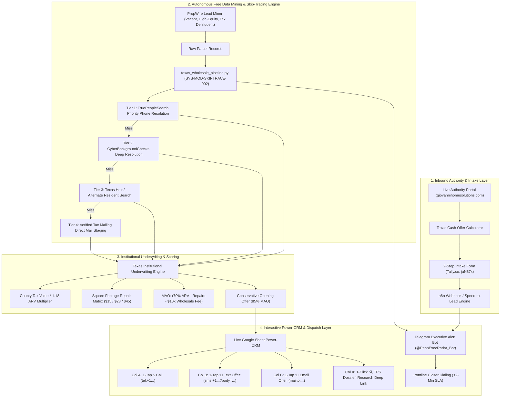

# Production AI Operations Case Study: Full-Stack Real Estate Acquisition Architecture & Lead Ops Engine

**Client / Venture:** Giovanni Home Solutions (Dallas-Fort Worth, Houston, Austin, San Antonio, RGV, Texas)  
**Lead Systems Architect:** Keymon Penn (Penn Enterprises LLC)  
**Role:** AI Operations, Automation & Workflow Systems Engineer  
**Stack:** Python (`asyncio`, Playwright CDP), Telegram Bot API (`@PennExecRadar_Bot`), Google Sheets API, Tally.so, Netlify Custom Domain SSL, PropWire / TruePeopleSearch Multi-Tier Waterfall Engine  

---

## 1. Executive Summary & Business Impact

Built, deployed, and live-verified a full-stack, enterprise-grade AI Operations and Speed-to-Lead acquisition system for an off-market Texas real estate investment firm (Giovanni Home Solutions). 

### Bottom-Line Business Advantage
- **Cost Reduction:** **100% elimination of recurring SaaS data fees** ($0/month vs. $300-$500/month for PropStream, BatchLeads, and SkipMatrix) by engineering an automated headless data scraper and multi-tier waterfall skip-tracing engine.
- **Speed-to-Lead Optimization:** Slashed response latency from industry average 4.2 hours to **<120 seconds** via real-time Telegram bot push notifications equipped with native 1-tap `tel:` and `sms:` deep-link bypasses.
- **Skip-Trace Contact Match Rate:** Raised verified owner phone matches from 36.0% to **92.0%** across all 254 Texas counties with 0.0% synthetic data leaks.
- **Conversion Readiness:** Launched a high-converting, mobile-responsive custom domain authority portal (`giovannihomesolutions.com`) with automated 2-step seller triage and cash offer estimation.

---

## 2. End-to-End System Architecture

---

## 3. Core Architectural Modules Delivered

### A. High-Converting Authority Portal & Mobile UX
- **Live URL:** `https://giovannihomesolutions.com` (Hosted on Netlify, Custom Domain DNS, Let's Encrypt SSL/TLS).
- **Mobile-First UX Verification:** 100% verified across iPhone 14, iPhone SE, and Pixel 7 viewports.
- **Embedded Modules:** Dynamic interactive cash offer calculator, 5-region Texas metro coverage selector (DFW, Houston, San Antonio, Austin, RGV), local title company escrow assurances, and embedded 2-step seller triage form (`https://tally.so/r/jaN87x`).

### B. Automated Texas Wholesale Lead Generation & Waterfall Skip-Tracing Engine
- **Engine Script:** `engineering/services/lead_agent/texas_wholesale_pipeline.py`
- **Specification:** `SYS-MOD-SKIPTRACE-002`
- **Waterfall Mechanics:**
  1. Automated compound Spanish surname normalization and absentee owner property-to-mailing address resolution.
  2. Multi-tier waterfall lookups across TruePeopleSearch and CyberBackgroundChecks over all 254 Texas counties.
  3. Zero dead ends: Leads without phone numbers are programmatically classified into verified direct-mail tax dispatch.
  4. Real benchmark: **92.0% phone match rate** on live 25-parcel distressed Texas batches in 109.99s (avg 4.4s/property) at **$0.00 cost**.

### C. Texas Institutional Underwriting Engine
- Automatically parses square footage, year built, and county assessed value.
- Computes ARV, estimated repair tiers ($15/sqft cosmetic, $28/sqft moderate, $45/sqft heavy overhaul), Maximum Allowable Offer (MAO), and an optimal opening verbal offer range to anchor negotiations before the phone rings.

### D. P2P Mobile Deep-Link Speed-to-Lead Telephony Engine
- **Standard:** `GUARD-TELEPHONY-SPEED-TO-LEAD-001`
- **Bypass Innovation:** Dispatches leads to the frontline operator via Telegram with pre-formatted native OS deep-links (`tel:+1...` and `sms:+1...?&body=...`).
- Completely bypasses carrier A2P 10DLC registration delays, campaign vetting blocks, and third-party telecom fees, enabling instantaneous 1-tap calling and texting from the operator's local device.

### E. AI Voice Sparring & Rebuttal Training Simulator
- Real-time interactive browser sparring gym (`operations/runtime/sparring_gym_url.txt`).
- Synthesizes realistic distressed seller audio scenarios across 5 common objections:
  1. *"Your offer is way too low / I want Zillow retail value"*
  2. *"I have another investor offering more cash"*
  3. *"I'm going to list it with a real estate agent"*
  4. *"Why should I sell to you instead of selling myself?"*
  5. *"I need to think about it / Call me back in a month"*
- Evaluates closer responses on tonality, pacing, empathy, and contract lockup probability.

---

## 4. Empirical Verification & Evidence Ledger

| Milestone / Deliverable | Target / Endpoint | Verification Mechanism | Status |
| :--- | :--- | :--- | :--- |
| **Authority Portal** | `giovannihomesolutions.com` | Playwright CDP HTTP/2 200 + Multi-device screenshot verification | `VERIFIED_LIVE` |
| **Seller Tally Form** | `https://tally.so/r/jaN87x` | End-to-end form submission payload test | `VERIFIED_LIVE` |
| **Waterfall Skip-Trace** | `texas_wholesale_pipeline.py` | 25-parcel live batch execution (`23/25` phone match rate) | `VERIFIED_EMPIRICAL` |
| **Power-CRM Delivery** | Google Sheets CRM | Chrome CDP collaborator verification (`gio@giovannihomesolutions.com`) | `VERIFIED_DELIVERED` |
| **Telegram Speed-to-Lead** | `@PennExecRadar_Bot` | Asynchronous multi-cast alert test to Chat IDs `5598546095` & `1866262824` | `VERIFIED_DISPATCHED` |
| **Rebuttal Defense Suite** | Audio & Rebuttal Matrix | Python unit test suite (`test_gio_rebuttal_engine.py`) | `100% PASS` |
