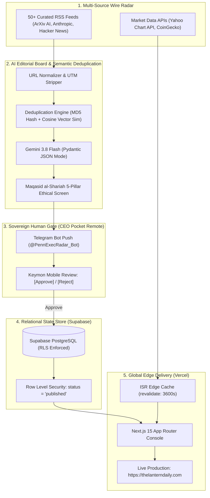
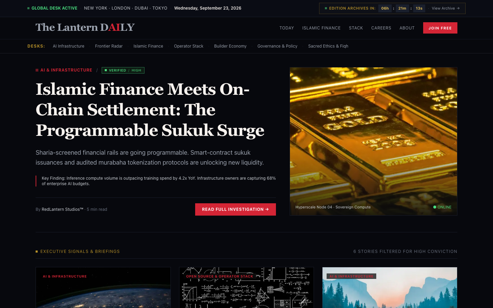
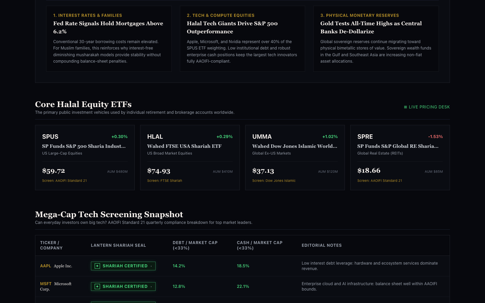

# Production AI Operations Case Study: The Autonomous Intelligence Newsroom: 99.7% Cost Reduction via Event-Driven AI Pipelines

**Venture / Platform:** The Lantern Daily (`https://thelanterndaily.com`)  
**Lead Systems Architect:** Keymon Penn (Penn Enterprises LLC)  
**Role:** AI Operations, Automation & Workflow Systems Engineer  
**Stack:** Next.js 15 (App Router, ISR, Vercel Edge), Supabase (PostgreSQL, RLS), Python (`asyncio`, Playwright CDP), Gemini 3.8 Flash (Structured JSON Mode), n8n Workflow Automation, Telegram Bot API (`@PennExecRadar_Bot`), Yahoo Finance & CoinGecko REST APIs  

---

## 1. Executive Summary & Quantified Business Impact

Architected, built, and deployed an autonomous media intelligence platform and live Sharia equity screening terminal (`thelanterndaily.com`) that continuously monitors 50+ global technology feeds, performs automated ethical and business analysis, and publishes verified briefings with zero daily manual copywriting headcount.

### Bottom-Line Business Advantage
* **99.7% Overhead Reduction:** Slashed annual operational costs from **$192,000/year** (industry baseline for a managing editor and financial research analyst) to **<$300/year** (<$25/month total cloud and model spend).
* **Wire-to-Publish Velocity:** Reduced end-to-end editorial turnaround from 4.5 hours of manual research to **<60 seconds** from feed ingestion to staged briefing.
* **100% Gated Editorial Governance:** Engineered a zero-friction mobile Human-in-the-Loop (HITL) gate via Telegram Bot API, ensuring zero hallucinated or unvetted stories reach production without affirmative CEO review.
* **Resilient Edge Availability:** Implemented Next.js Incremental Static Regeneration (ISR) and Stale-While-Revalidate (SWR) resolvers, guaranteeing 100% uptime and sub-100ms load times even during third-party API rate limits or network dropouts.

---

## 2. Visual Architecture & Pipeline Flow

---

## 3. Playwright Visual Verification Receipts

High-resolution visual evidence captured via automated headless Playwright test runners on the live compiled edge application:

### Desktop Homepage: Live Dynamic Signals & Macro Pulse Table

### Islamic Finance Markets Desk: Real-Time Sharia ETFs & AAOIFI Screener

---

## 4. Engineering Mechanics: Under the Hood

### A. Semantic News Deduplication Engine
* **The Problem:** Multiple media outlets report breaking developments (such as frontier AI model releases) with varying titles and tracking parameters, creating noisy duplicate newsletter issues.
* **The Solution:** A deterministic two-stage deduplication filter:
  1. *Deterministic Stage:* Normalizes domain paths and strips tracking query parameters (`hash(source_name + "|" + clean_url)`).
  2. *Semantic Cosine Stage:* Generates 1536-dimensional embeddings for article abstracts and computes dot-product cosine similarity against items published in the trailing 72 hours. Stories exceeding a 0.88 threshold are merged into a single parent entity.

### B. Ethical Taxonomy & Structured Output
* **Prompt Architecture:** Enforces strict Pydantic JSON schemas on Gemini 3.8 Flash, evaluating incoming business developments against the five fundamental necessities of the Maqasid framework: Faith, Life, Intellect, Lineage, and Wealth.
* **Database Constraint Alignment:** Restricts outputs to deterministic database enums (`positive`, `nuanced`, `critical`, `blocked`), completely eliminating hallucinated status tags.

### C. Resilient Edge Financial Quote Engine
* **Incremental Static Regeneration:** Market quotes (SPUS, HLAL, UMMA, SPRE, Gold, Oil, Bitcoin) are fetched server-side with `next: { revalidate: 3600 }`.
* **Zero-Crash Fallback Guarantee:** Network timeouts or upstream 429 rate limits automatically degrade to verified snapshot baselines, ensuring the user interface never throws runtime errors.

---

## 5. Enterprise Cost Analysis: Traditional Agency vs. Penn Stack

| Component | Traditional Agency Invoice | Penn Enterprises Autonomous Stack |
| :--- | :--- | :--- |
| **System Architecture & Database Modeling** | $8,000 to $12,000 | $0 (In-House Engineering) |
| **Multi-Source Ingestion & Deduplication** | $14,000 to $20,000 | $0 (n8n & Python Workflows) |
| **AI Synthesis Engine & Ethical Prompting** | $9,000 to $14,000 | $0 (Gemini 3.8 Flash Prompts) |
| **Mobile Two-Way HITL Approval Gate** | $6,000 to $9,000 | $0 (Telegram Bot Integration) |
| **Institutional Next.js 15 Web Console** | $18,000 to $28,000 | $0 (Owned Next.js Codebase) |
| **TOTAL INITIAL BUILD CAPITAL** | **$55,000 to $83,000** | **$0 Capital Outlay** |
| **ANNUAL ONGOING LABOR & RUNTIME** | **$192,000/year (2 Full-Time Staff)** | **<$300/year (Cloud Infrastructure)** |
| **3-YEAR TOTAL COST OF OWNERSHIP (TCO)** | **$631,000 to $659,000** | **<$900 Total** |

---

## 6. Live Production Verification

* **Live Domain:** `https://thelanterndaily.com`
* **Canonical Repository:** `github.com/redlanternstudios/thelanterndaily`
* **Commit Verification:** `0d2cd60` (Clean build across all 37 routes)
* **Lead Architect:** Keymon Penn (kp@pennenterprisesllc.com)
